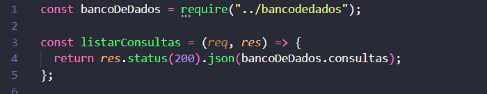
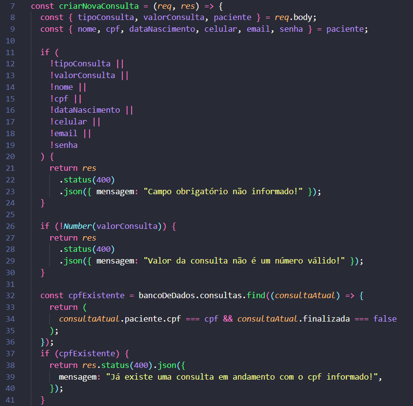
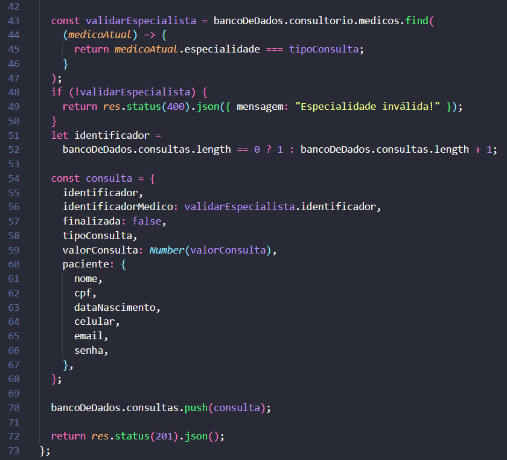

Foi criada uma api para um Consultório Médico no qual foi desenvolvida uma RESTful API que permite:

- Listar consultas médicas
- Criar consulta médica
- Atualizar os dados de uma consulta médica
- Excluir uma consulta médica
- Finalizar uma consulta médica
- Listar o laudo de uma consulta
- Listar as consultas que um médico atendeu

**Segue as rotas com status code correspondendes às respostas da API**


## Endpoints

### Listar consultas médicas

#### `GET` `/consultas?cnes_consultorio=1001&senha_consultorio=CubosHealth@2022`

Esse end-point lista todas as consultas médicas.
  - Verificando se o cnes e a senha do consultório foram informados (passado como query params na url).
  - Validando se o cnes a senha do consultório estão corretos.

- **Requisição** - query params

  - cnes_consultorio
  - senha_consultorio

- **Resposta**
  - Listagem de todas as consultas.



### Criar consulta médica

#### `POST` `/consulta`

Esse endpoint deverá cria uma consulta médica, onde será gerado um identificador único para identificação da consulta (identicador da consulta).
  - Verifica se todos os campos foram informados (todos são obrigatórios) 
  - Verifica se o valor da consulta é numérico
  - Verifica se o CPF informado já não está vinculado a nenhuma consulta que não foi finalizada
  - Valida se o tipo da consulta informado consta nas especialidade dos médicos na base
  - Vincula o identificador do médico especializado que irá atender a consulta em questão no momento de criação da consulta
  - Define _finalizada_ como false
  - Cria uma consulta médica cuja o identificador é único

- **Requisição** - O corpo (body) deverá possuir um objeto com as seguintes propriedades:

  - tipoConsulta
  - valorConsulta
  - paciente
    - nome
    - cpf
    - dataNascimento
    - celular
    - email
    - senha




### Atualizar os dados de uma consulta médica

#### `PUT` `/consulta/:identificadorConsulta/paciente`

Esse endpoint deverá atualizar apenas os dados do paciente de uma consulta médica que não esteja finalizada.

- Você deverá, **OBRIGATORIAMENTE**:

  - Verificar se foi passado todos os campos no body da requisição
  - Verificar se o identificador da consulta passado como parametro na URL é válido
  - Se o CPF for informado, verificar se já existe outro registro com o mesmo CPF
  - Se o E-mail for informado, verificar se já existe outro registro com o mesmo E-mail
  - Verifica se a consulta não esta finalizada
  - Atualizar os dados do usuário de uma consulta médica

- **Requisição** - O corpo (body) deverá possuir um objeto com todas as seguintes propriedades (respeitando estes nomes):

  - nome
  - cpf
  - dataNascimento
  - celular
  - email
  - senha

- **Resposta**

  Em caso de **sucesso**, não deveremos enviar conteúdo no corpo (body) da resposta.
  Em caso de **falha na validação**, a resposta deverá possuir **_status code_** apropriado, e em seu corpo (body) deverá possuir um objeto com uma propriedade **mensagem** que deverá possuir como valor um texto explicando o motivo da falha.

#### Exemplo de Requisição

```javascript
// PUT /consulta/:identificadorConsulta/paciente
{
  "nome": "John Doe",
  "cpf": "55132392051",
  "dataNascimento": "2022-02-02",
  "celular": "11999997777",
  "email": "john@doe.com",
  "senha": "1234"
}
```

#### Exemplo de Resposta

```javascript
// HTTP Status 204 - No Content
// Sem conteúdo no corpo (body) da resposta
```

```javascript
// HTTP Status 400
{
    "mensagem": "Cpf já consta na base!"
}
```

### Excluir uma consulta médica

#### `DELETE` `/consulta/:identificadorConsulta`

Esse endpoint deve excluir uma consulta médica existente, esta consulta não pode estar _finalizada_.

- Você deverá, **OBRIGATORIAMENTE**:

  - Verificar se o identificador da consulta médica passado como parametro na URL é válido
  - Permitir excluir uma consulta apenas se _finalizada_ for igual a false
  - Remover a consulta do objeto de persistência de dados

- **Requisição**

  - Identificador da consulta (passado como parâmetro na rota)

- **Resposta**

  Em caso de **sucesso**, não deveremos enviar conteúdo no corpo (body) da resposta.  
  Em caso de **falha na validação**, a resposta deverá possuir **_status code_** apropriado, e em seu corpo (body) deverá possuir um objeto com uma propriedade **mensagem** que deverá possuir como valor um texto explicando o motivo da falha.

#### Exemplo de Resposta

```javascript
// HTTP Status 204 - No Content
// Sem conteúdo no corpo (body) da resposta
```

```javascript
// HTTP Status 400
{
  "mensagem": "A consulta só pode ser removida se a mesma não estiver finalizada"
}
```

### Finalizar uma consulta médica

#### `POST` `/consulta/finalizar`

Esse endpoint deverá finalizar uma consulta com um texto de laudo válido do médico e registrar esse laudo e essa consulta finalizada.

- Você deverá, **OBRIGATORIAMENTE**:

  - Verificar se foi passado todos os campos no body da requisição
  - Verificar se o identificador da consulta existe
  - Verificar se a consulta já esta finalizada
  - Verificar se o texto do médico possui um tamanho > 0 e <= 200 carácteres
  - Armazenar as informações do laudo na persistência de dados
  - Armazenar a consulta médica finalizada na persistência de dados

- **Requisição** - O corpo (body) deverá possuir um objeto com as seguintes propriedades (respeitando estes nomes):

  - identificadorConsulta
  - textoMedico

- **Resposta**

  Em caso de **sucesso**, não deveremos enviar conteúdo no corpo (body) da resposta.  
  Em caso de **falha na validação**, a resposta deverá possuir **_status code_** apropriado, e em seu corpo (body) deverá possuir um objeto com uma propriedade **mensagem** que deverá possuir como valor um texto explicando o motivo da falha.

#### Exemplo de Requisição

```javascript
// POST /consulta/finalizar
{
	"identificadorConsulta": 1,
	"textoMedico": "XPTO"
}
```

#### Exemplo de Resposta

```javascript
// HTTP Status 204 - No Content
// Sem conteúdo no corpo (body) da resposta
```

```javascript
// HTTP Status 400
{
    "mensagem": "O tamanho do textoMedico não está dentro do esperado"
}
```

#### Exemplo do registro de uma consulta médica finalizada

```javascript
{
  "identificador": 1,
  "tipoConsulta": "GERAL",
  "identificadorMedico": 1,
  "finalizada": true,
  "identificadorLaudo": 1,
  "valorConsulta": 3000,
  "paciente": {
    "nome": "John Doe",
    "cpf": "55132392051",
    "dataNascimento": "2022-02-02",
    "celular": "11999997777",
    "email": "john@doe.com",
    "senha": "1234"
   }
}
```

#### Exemplo do registro de um laudo

```javascript
{
  "identificador": 1,
  "identificadorConsulta": 3,
  "identificadorMedico": 2,
  "textoMedico": "XPTO",
  "paciente": {
     "nome": "John Doe",
     "cpf": "55132392051",
     "dataNascimento": "2022-02-02",
     "celular": "11999997777",
     "email": "john@doe.com",
     "senha": "1234"
  }
}
```

### Listar o laudo de uma consulta

#### `GET` `/consulta/laudo?identificador_consulta=1&senha=1234`

Esse endpoint deverá retornar informações do laudo de uma consulta junto as informações adicionais das entidades relacionadas aquele laudo.

- Você deverá, **OBRIGATORIAMENTE**:

  - Verificar se o identificador da consulta e a senha foram informados (passado como query params na url)
  - Verificar se a consulta médica informada existe
  - Verificar se a senha informada é uma senha válida
  - Verificar se existe um laudo para consulta informada
  - Exibir o laudo da consulta médica em questão junto as informações adicionais

- **Requisição** - query params

  - identificador_consulta
  - senha

- **Resposta**

  - Informações do laudo e das entidades relacionadas

#### Exemplo de Resposta

```javascript
// HTTP Status 200 - Success
{
  "identificador":1,
  "identificadorConsulta": 3,
  "identificadorMedico": 2,
  "textoMedico": "XPTO",
  "paciente": {
    "nome": "John Doe",
    "cpf": "55132392051",
    "dataNascimento": "2022-02-02",
    "celular": "11999997777",
    "email": "john@doe.com",
    "senha": "1234"
  }
}
```

```javascript
// HTTP Status 400 / 401 / 403 / 404
{
  "mensagem": "Consulta médica não encontrada!"
}
```

### Listar as consultas que um médico atendeu

#### `GET` `/consultas/medico?identificador_medico=1`

Esse endpoint deverá retornar todas as consultas que um profissional **_atendeu_**, ou seja, finalizadas.

- Você deverá, **OBRIGATORIAMENTE**:

  - Verificar se o identificador do medico foi informado (passado como query params na url)
  - Verificar se o médico existe
  - Exibir as consultas vinculadas ao médico

- **Requisição** - query params

  - identificador_medico

- **Resposta**

  - Listagem das consultas vinculadas ao médico

#### Exemplo de Resposta

```javascript
// HTTP Status 200 - Success
[
  {
    identificador: 1,
    tipoConsulta: "GERAL",
    identificadorMedico: 1,
    finalizada: true,
    identificadorLaudo: 1,
    valorConsulta: 3000,
    paciente: {
      nome: "John Doe",
      cpf: "55132392051",
      dataNascimento: "2022-02-02",
      celular: "11999997777",
      email: "john@doe.com",
      senha: "1234",
    },
  },
  {
    identificador: 3,
    tipoConsulta: "GERAL",
    identificadorMedico: 1,
    finalizada: true,
    identificadorLaudo: 1,
    valorConsulta: 5000,
    paciente: {
      nome: "John Doe 3",
      cpf: "55132392053",
      dataNascimento: "2022-02-02",
      celular: "11999997777",
      email: "john@doe3.com",
      senha: "1234",
    },
  },
];
```

```javascript
// HTTP Status 400 / 401 / 403 / 404
{
  "mensagem": "O médico informado não existe na base!"
}
```

## Aulas úteis:

- [Rotas, Intermediários e Controladores](https://aulas.cubos.academy/turma/c6635882-58d1-4c92-9908-f93813988b73/aulas/93a577ce-c5b3-4795-add2-d21e060d20e1)
- [Aula API REST](https://aulas.cubos.academy/turma/c6635882-58d1-4c92-9908-f93813988b73/aulas/ec754df8-843c-4018-a9ed-bc65e424c3b2)
- [Formatando datas com date-fns](https://aulas.cubos.academy/turma/c6635882-58d1-4c92-9908-f93813988b73/aulas/c491c422-e1ec-4e2e-b463-e7388b329a5a)
- [Aula de objetos](https://aulas.cubos.academy/turma/c6635882-58d1-4c92-9908-f93813988b73/aulas/c2ca98f2-cff8-42c3-987b-f52181ed8c66)
- [Aula de funções](https://aulas.cubos.academy/turma/c6635882-58d1-4c92-9908-f93813988b73/aulas/8add9839-5365-4e3c-8ec8-3d464155de91)

**LEMBRE-SE**: Feito é melhor do que perfeito, mas não faça mal feito!!!

###### tags: `back-end` `módulo 2` `nodeJS` `API REST` `desafio-alternativo`
