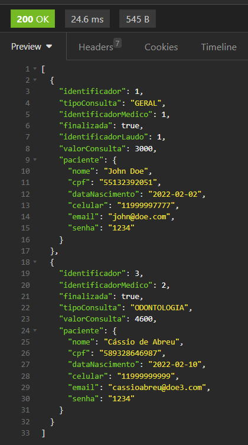

# API para um Consultório Médico - criado para um desafio da Cubos Academy

Esse código foi desenvolvido para construir uma RESTful API que permite:

- Listar consultas médicas
- Criar consulta médica
- Atualizar os dados de uma consulta médica
- Excluir uma consulta médica
- Finalizar uma consulta médica
- Listar o laudo de uma consulta
- Listar as consultas que um médico atendeu

## Endpoints

### 1º Listar consultas médicas

#### `GET` `/consultas?cnes_consultorio=1001&senha_consultorio=CubosHealth@2022`

Esse end-point lista todas as consultas médicas.
  - Verifica se o cnes e a senha do consultório foram informados (passado como query params na url).
  - Valida se o cnes a senha do consultório estão corretos.

- **Na requisição você deve inserir os parametros:** - query params

  - cnes_consultorio
  - senha_consultorio

  

- **Resposta:**
  - Listagem de todas as consultas.

### 2º Criar consulta médica

#### `POST` `/consulta`

Esse endpoint cria uma consulta médica, onde será gerado um identificador único para identificação da consulta.
  - Verifica se todos os campos foram informados
  - Verifica se o valor da consulta é numérico
  - Verifica se o CPF informado já não está vinculado a nenhuma consulta que não foi finalizada
  - Valida se o tipo da consulta informado consta nas especialidade dos médicos na base
  - Vincula o identificador do médico especializado que irá atender a consulta em questão no momento de criação da consulta
  - Define _finalizada_ como false
  - Cria uma consulta médica cuja o identificador é único

- **Na requisição deve inserir um objeto com as seguintes propriedades:** 

  - tipoConsulta
  - valorConsulta
  - paciente
    - nome
    - cpf
    - dataNascimento
    - celular
    - email
    - senha

- **Resposta**

  Em caso de **sucesso**, não é enviado conteúdo no corpo (body) da resposta.  
   Em caso de **falha na validação**, a resposta apresenta o **_status code_** apropriado, e em seu corpo (body) possui um objeto com uma propriedade **mensagem** que explica o motivo da falha.

Dessa forma fica o GET de listagem de consultas após a requisição:

### 3º Atualizar os dados de uma consulta médica

#### `PUT` `/consulta/:identificadorConsulta/paciente`

Esse endpoint atualiza apenas os dados do paciente de uma consulta médica que não esteja finalizada.
  - Verifica se foi passado todos os campos no body da requisição
  - Verifica se o identificador da consulta passado como parametro na URL é válido
  - Se o CPF for informado, verifica se já existe outro registro com o mesmo CPF
  - Se o E-mail for informado, verifica se já existe outro registro com o mesmo E-mail
  - Verifica se a consulta não esta finalizada
  - Atualiza os dados do usuário de uma consulta médica

- **Na requisição deve inserir um objeto com as seguintes propriedades:** 
  - nome
  - cpf
  - dataNascimento
  - celular
  - email
  - senha

- **Resposta**

Em caso de **sucesso**, não é enviado conteúdo no corpo (body) da resposta.  
   Em caso de **falha na validação**, a resposta apresenta o **_status code_** apropriado, e em seu corpo (body) possui um objeto com uma propriedade **mensagem** que explica o motivo da falha.

Dessa forma se apresenta o GET de listagem de consultas após a atualização:
  

### 4º Excluir uma consulta médica

#### `DELETE` `/consulta/:identificadorConsulta`

Esse endpoint exclui uma consulta médica existente
  - Verifica se o identificador da consulta médica passado como parametro na URL é válido
  - Permite excluir uma consulta apenas se _finalizada_ for igual a false
  - Remove a consulta 

- **Na requisição você deve passar como parâmetro na rota:**

  - Identificador da consulta 

  

- **Resposta**

Em caso de **sucesso**, não é enviado conteúdo no corpo (body) da resposta.  
   Em caso de **falha na validação**, a resposta apresenta o **_status code_** apropriado, e em seu corpo (body) possui um objeto com uma propriedade **mensagem** que explica o motivo da falha.

Dessa forma fica o GET de listagem de consulta após a exclusão:

### 5º Finalizar uma consulta médica

#### `POST` `/consulta/finalizar`

Esse endpoint finaliza uma consulta com um texto de laudo válido do médico e registra esse laudo e essa consulta finalizada.
  - Verificaa se foi passado todos os campos no body da requisição
  - Verifica se o identificador da consulta existe
  - Verifica se a consulta já esta finalizada
  - Verifica se o texto do médico possui um tamanho > 0 e <= 200 carácteres
  - Armazena as informações do laudo
  - Armazena a consulta médica finalizada 

- **Na requisição, o body você deve passar um objeto com as seguintes propriedades:** 
  - identificadorConsulta
  - textoMedico

- **Resposta**

  Em caso de **sucesso**, não é enviado conteúdo no corpo (body) da resposta.  
   Em caso de **falha na validação**, a resposta apresenta o **_status code_** apropriado, e em seu corpo (body) possui um objeto com uma propriedade **mensagem** que explica o motivo da falha.

  Dessa forma fica o GET de listagem de consulta após a exclusão:
  

### 6º Listar o laudo de uma consulta

#### `GET` `/consulta/laudo?identificador_consulta=1&senha=1234`

Esse endpoint retorna informações do laudo de uma consulta junto as informações adicionais das entidades relacionadas aquele laudo.
  - Verifica se o identificador da consulta e a senha foram informados (passado como query params na url)
  - Verifica se a consulta médica informada existe
  - Verifica se a senha informada é uma senha válida
  - Verifica se existe um laudo para consulta informada
  - Exibe o laudo da consulta médica em questão junto as informações adicionais

- **Requisição - query params:**

  - identificador_consulta
  - senha

  

- **Resposta**

  - Informações do laudo e das entidades relacionadas

  

### 7º Listar as consultas que um médico atendeu

#### `GET` `/consultas/medico?identificador_medico=1`

Esse endpoint retorna todas as consultas que um profissional **_atendeu_**, ou seja, finalizadas.
  - Verifica se o identificador do medico foi informado (passado como query params na url)
  - Verifica se o médico existe
  - Exibe as consultas vinculadas ao médico

- **Requisição** - query params

  - identificador_medico

  

- **Resposta**

  - Listagem das consultas vinculadas ao médico

  